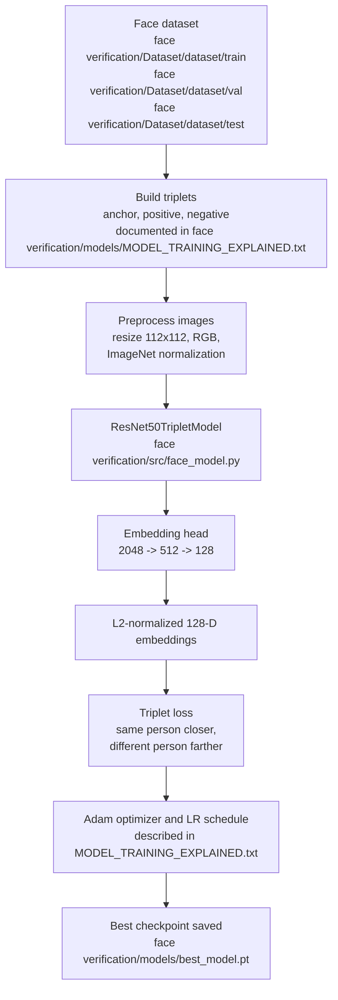
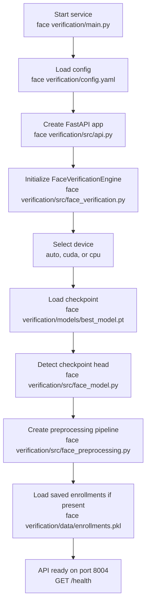
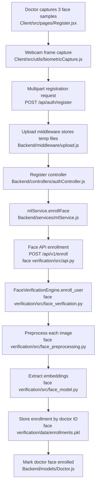
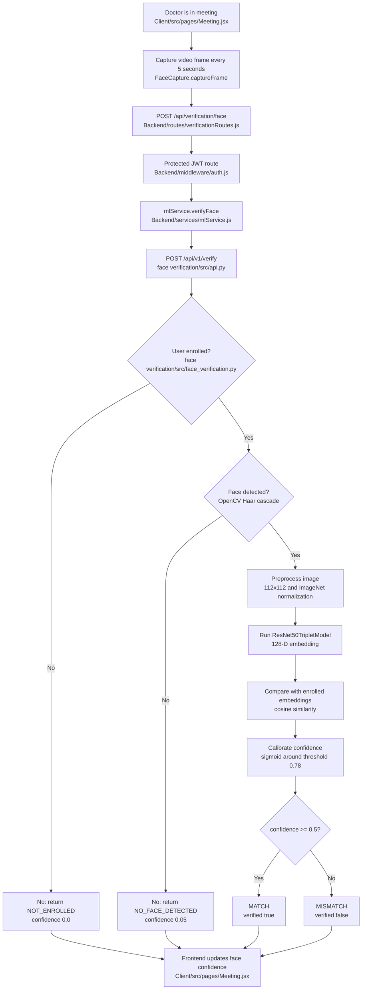

# New Model Flow: Face Verification

This document explains the new face verification model, how it was created, and how it is used inside this project. The model is only used by the face verification service; it is not shared with voice, keystroke, mouse, appointment, or consultation logic.

## Main Two Parts

1. Model creation and training

   The face model was created as a ResNet50 triplet-loss embedding model. It learns to convert a face image into a compact numeric identity vector. Same-person images should produce vectors close to each other, and different-person images should produce vectors farther apart.

2. Model runtime usage in face verification only

   The trained checkpoint is loaded by the standalone Face Verification API. The frontend and backend only send face images to that API for doctor enrollment and verification. Other biometric services use their own separate models and files.

## Active Runtime Files

| Purpose | File path |
|---|---|
| Face service entry point | `face verification/main.py` |
| Face API routes | `face verification/src/api.py` |
| Model architecture and checkpoint loading | `face verification/src/face_model.py` |
| Image preprocessing | `face verification/src/face_preprocessing.py` |
| Enrollment and verification engine | `face verification/src/face_verification.py` |
| Runtime configuration | `face verification/config.yaml` |
| Active checkpoint configured by the service | `face verification/models/best_model.pt` |
| Older/alternate checkpoint still present | `face verification/models/best_resnet50_triplet.pth` |
| Saved face enrollments | `face verification/data/enrollments.pkl` |
| Model training explanation | `face verification/models/MODEL_TRAINING_EXPLAINED.txt` |
| Dataset split folders | `face verification/Dataset/dataset/train`, `face verification/Dataset/dataset/val`, `face verification/Dataset/dataset/test` |

Important: the runtime configuration in `face verification/config.yaml` points to `models/best_model.pt`. That is the active model unless the `model.checkpoint_path` value is changed.

## How The Model Was Created

The model is a Siamese-style triplet network. During training it sees three images at a time:

| Triplet item | Meaning |
|---|---|
| Anchor | A face image of a person |
| Positive | A different face image of the same person |
| Negative | A face image of another person |

The training goal is:

- Pull the anchor and positive embeddings closer together.
- Push the anchor and negative embeddings farther apart.
- Save the best checkpoint when validation loss improves.

The training documentation in `face verification/models/MODEL_TRAINING_EXPLAINED.txt` describes a triplet training setup with 10,104 triplets split into training, validation, and test sets. The checked-in dataset folders are identity-based image splits:

| Split | Path | Identity folders | Image files |
|---|---|---:|---:|
| Train | `face verification/Dataset/dataset/train` | 432 | 105,997 |
| Validation | `face verification/Dataset/dataset/val` | 54 | 12,579 |
| Test | `face verification/Dataset/dataset/test` | 54 | 12,829 |

Those identity folders are used to form same-person and different-person pairs/triplets during training.

## Model Architecture

The architecture is implemented in `face verification/src/face_model.py`.

| Layer or stage | Details | Why it exists |
|---|---|---|
| Input image | RGB face image resized to `112x112` | Keeps inference fast while preserving facial features |
| ResNet50 backbone | Pretrained ResNet50 feature extractor | Strong visual feature extraction from transfer learning |
| Embedding head | MLP head: `2048 -> 512 -> 128` | Converts ResNet features into a compact identity embedding |
| BatchNorm, ReLU, Dropout | Used in the MLP head | Stabilizes training and reduces overfitting |
| L2 normalization | Normalizes output vector length to 1 | Makes cosine similarity comparisons consistent |
| Output | 128-dimensional embedding | Small enough to store and compare efficiently |

The checkpoint loader in `face verification/src/face_model.py` supports both:

- New MLP-head checkpoints with keys like `head.0.weight` and `head.4.weight`.
- Legacy single-FC-head checkpoints with keys like `fc.weight`.

The loader uses strict checkpoint loading so the API does not silently run a partially initialized model.

## Training Flowchart



## Runtime Loading Flow



## How The Model Is Used Only In Face Verification

The face model is used in exactly one ML service: `face verification`. The main application reaches it through the backend service wrapper:

| Step | File path | What happens |
|---|---|---|
| Frontend captures face | `Client/src/utils/biometricCapture.js` | `FaceCapture` opens the webcam and creates JPEG `File` objects |
| Doctor registration submits face images | `Client/src/pages/Register.jsx` | Requires 3 face samples before registration |
| Backend receives upload | `Backend/routes/authRoutes.js` and `Backend/middleware/upload.js` | `faceImages` are accepted as multipart files |
| Backend enrolls face | `Backend/controllers/authController.js` | Calls `mlService.enrollFace(...)` |
| Backend talks to face API | `Backend/services/mlService.js` | Posts images to `http://localhost:8004/api/v1/enroll` |
| Face API runs model | `face verification/src/api.py` and `face verification/src/face_verification.py` | Extracts embeddings and stores enrollment |
| Face verification during consultation | `Client/src/pages/Meeting.jsx` | Captures a video frame every 5 seconds |
| Backend verifies frame | `Backend/routes/verificationRoutes.js` | Calls `mlService.verifyFace(...)` |
| Face API returns result | `face verification/src/face_verification.py` | Returns `verified`, `confidence_score`, `raw_similarity`, and `decision` |

No voice, keystroke, or mouse files import `ResNet50TripletModel`. Their code paths go through separate services:

- Voice: `Voiceprint Analysis/`
- Keystroke: `Keystroke Dynamics/`
- Mouse: `Mouse Movement Analysis/`
- Face: `face verification/`

## Face Enrollment Flow



## Face Verification Flow



## Runtime Decision Logic

The raw face similarity threshold is configured in `face verification/config.yaml`:

```yaml
verification:
  similarity_metric: "cosine"
  threshold: 0.78
```

The engine does not return raw similarity as the only user-facing score. In `face verification/src/face_verification.py`, it converts raw cosine similarity into a calibrated confidence:

```text
center = threshold
scale = 0.05
z = (max_similarity - center) / scale
confidence = sigmoid(z)
verified = confidence >= 0.5
```

This means:

| Raw similarity | Approximate outcome with threshold `0.78` |
|---:|---|
| `0.95` | Strong match |
| `0.90` | Match |
| `0.85` | Likely match |
| `0.78` | Decision boundary |
| `0.75` | Likely mismatch |
| `0.70` | Strong mismatch |

## Why This Model Design Is Best For This Application

- Triplet learning is a good fit because the application needs verification, not just classification. New doctors can enroll by storing embeddings instead of retraining a classifier for every new doctor.
- ResNet50 is a strong transfer-learning backbone for face images, so the model starts from robust visual features rather than learning all low-level image features from scratch.
- A 128-dimensional embedding is compact. It is fast to compare, cheap to store, and still expressive enough for identity verification.
- L2 normalization plus cosine similarity gives stable comparisons between enrolled samples and live webcam frames.
- Keeping face verification in `face verification/` isolates model dependencies like PyTorch, TorchVision, FastAPI, Pillow, and OpenCV from the Node.js backend.
- The backend stores only enrollment references in `Backend/models/Doctor.js`, while the face service stores embeddings in `face verification/data/enrollments.pkl`. Raw registration and verification images are treated as temporary upload files and deleted after use.
- The face service can be improved or replaced independently by changing `face verification/models/best_model.pt` and `face verification/config.yaml` without changing appointment, login, voice, keystroke, or mouse workflows.

## Summary

The new model is the active `best_model.pt` ResNet50 triplet embedding model. It was created to turn face images into 128-dimensional identity embeddings. At runtime, the application only uses it through the Face Verification API on port `8004`, and only for face enrollment and face verification.
