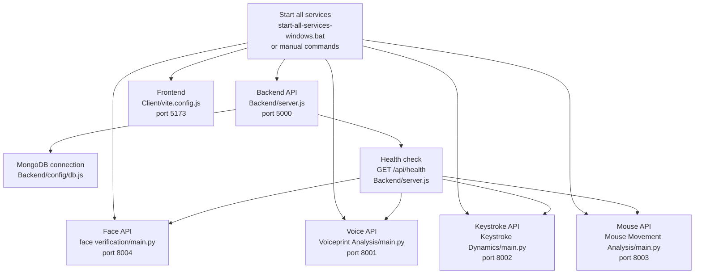
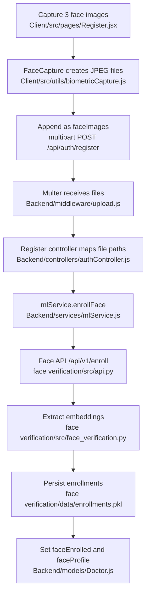
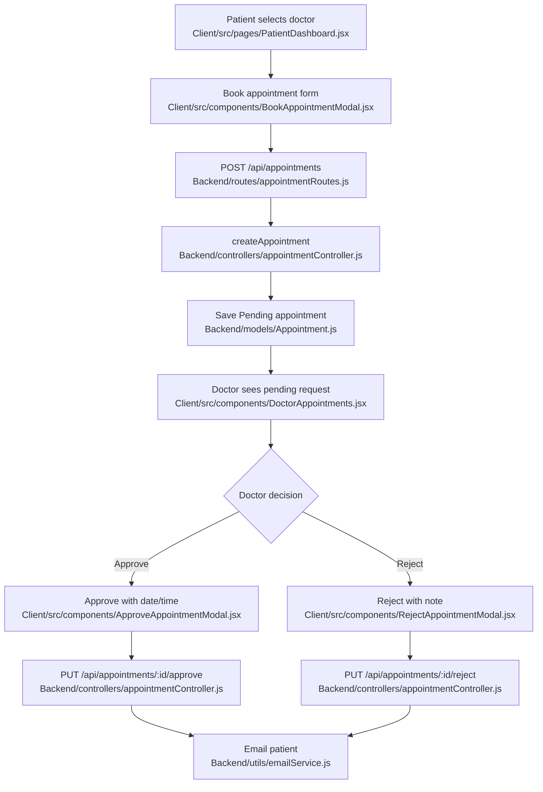
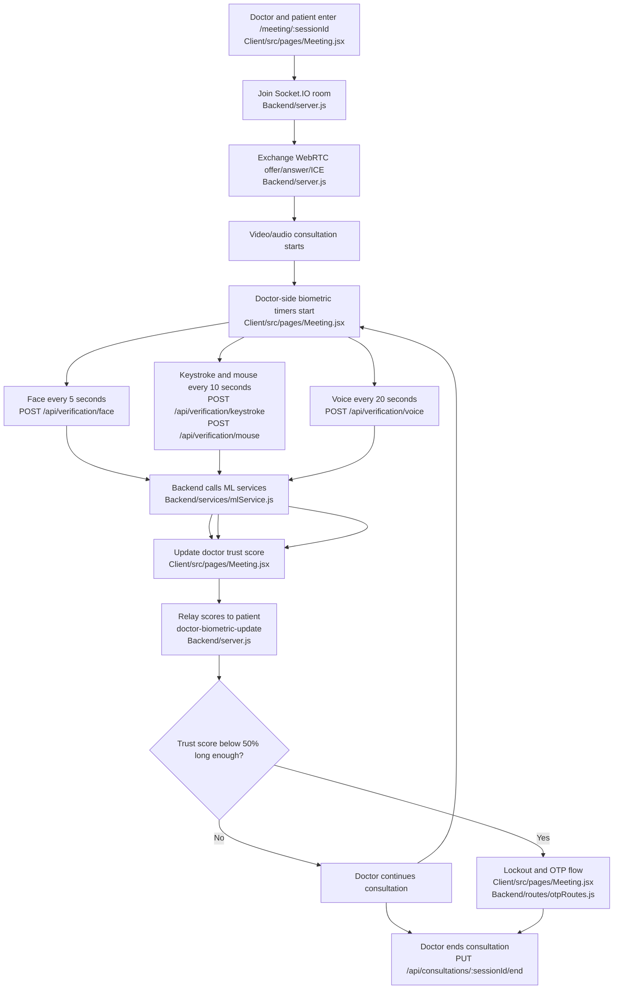
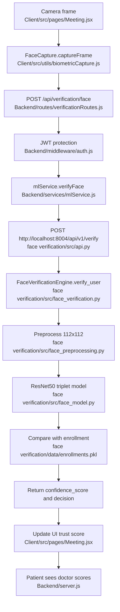

# Application Workflow: Beginning To End

This document explains how the full Zero Trust Telehealth application works from startup to consultation completion. It includes the main flow, the relevant file paths, and the reasoning behind the design.

## Main Two Parts Of The Application

1. Application layer

   This is the telehealth product itself: registration, login, dashboards, appointments, consultations, WebRTC video calls, email notifications, JWT authentication, and MongoDB records.

   Main folders:

   - `Client/`
   - `Backend/`

2. Biometric verification layer

   This is the continuous trust system. It verifies whether the active doctor is still the enrolled doctor during consultation.

   Main folders:

   - `face verification/`
   - `Voiceprint Analysis/`
   - `Keystroke Dynamics/`
   - `Mouse Movement Analysis/`

The best way to understand the design is: the frontend captures user activity, the backend controls security and data flow, and the Python ML services perform model inference.

## Service Layout

| Service | Port | Main file | Responsibility |
|---|---:|---|---|
| Frontend | `5173` | `Client/src/App.jsx` | React UI, routes, camera/mic/input capture |
| Backend | `5000` | `Backend/server.js` | API gateway, auth, database, Socket.IO, ML service calls |
| Face Verification API | `8004` | `face verification/main.py` | Face enrollment and verification using ResNet50 triplet model |
| Voiceprint API | `8001` | `Voiceprint Analysis/main.py` | Voice enrollment and verification |
| Keystroke API | `8002` | `Keystroke Dynamics/main.py` | Keystroke enrollment and verification |
| Mouse API | `8003` | `Mouse Movement Analysis/main.py` | Mouse movement enrollment and verification |
| Database | MongoDB | `Backend/config/db.js` | Stores doctors, patients, appointments, consultations, sessions |

## Startup Flow



Why this is best: each ML model runs as an independent service. The Node.js backend does not need to load PyTorch, TorchVision, SpeechBrain, or other heavy ML libraries. If one biometric model changes, the frontend and core backend workflow can stay stable.

## End-To-End Product Flowchart

```mermaid
flowchart TD
    A["User opens frontend<br/>Client/src/main.jsx<br/>Client/src/App.jsx"]
    B{"User type?"}
    C["Patient registration/login<br/>Client/src/pages/Register.jsx<br/>Backend/controllers/authController.js"]
    D["Doctor registration with biometrics<br/>Client/src/pages/Register.jsx<br/>Client/src/utils/biometricCapture.js"]
    E["Backend creates user and JWT<br/>Backend/controllers/authController.js<br/>Backend/middleware/auth.js"]
    F["Doctor biometric enrollment<br/>Backend/services/mlService.js"]
    G["Face enroll only<br/>face verification/src/api.py<br/>POST /api/v1/enroll"]
    H["Voice, keystroke, mouse enroll<br/>separate ML service folders"]
    I["Dashboard routing<br/>Client/src/context/AuthContext.jsx<br/>Client/src/components/PrivateRoute.jsx"]
    J["Patient books appointment<br/>Client/src/components/BookAppointmentModal.jsx<br/>POST /api/appointments"]
    K["Appointment stored<br/>Backend/controllers/appointmentController.js<br/>Backend/models/Appointment.js"]
    L["Doctor approves appointment<br/>Client/src/components/DoctorAppointments.jsx<br/>PUT /api/appointments/:id/approve"]
    M["Approved consultation appears<br/>Client/src/components/ScheduledConsultations.jsx<br/>Client/src/components/ConfirmedConsultations.jsx"]
    N["Doctor start verification modal<br/>Client/src/components/ConsultationStartVerificationModal.jsx"]
    O["Four checks run through backend<br/>Backend/routes/verificationRoutes.js"]
    P{"Enough checks pass?"}
    Q["Start consultation<br/>POST /api/consultations/doctor/:appointmentId/start<br/>Backend/controllers/consultationController.js"]
    R["Create active room<br/>consultationRoomId = room-appointmentId<br/>Backend/models/Consultation.js"]
    S["Meeting page<br/>Client/src/pages/Meeting.jsx"]
    T["Socket.IO and WebRTC signaling<br/>Backend/server.js"]
    U["Continuous doctor biometric checks<br/>Client/src/pages/Meeting.jsx"]
    V["Face every 5s through Face API<br/>face verification/src/face_verification.py"]
    W["Voice every 20s, keystroke/mouse every 10s<br/>separate ML APIs"]
    X["Trust score and patient visibility<br/>Client/src/pages/Meeting.jsx<br/>Backend/server.js"]
    Y{"Trust remains acceptable?"}
    Z["Continue consultation"]
    AA["Lockout and OTP recovery<br/>Client/src/pages/Meeting.jsx<br/>Backend/routes/otpRoutes.js"]
    AB["End consultation<br/>PUT /api/consultations/:sessionId/end<br/>Backend/controllers/consultationController.js"]

    A --> B
    B -- "Patient" --> C --> E --> I --> J --> K
    B -- "Doctor" --> D --> E --> F
    F --> G
    F --> H
    G --> I
    H --> I
    K --> L --> M --> N --> O --> P
    P -- "No" --> N
    P -- "Yes" --> Q --> R --> S --> T --> U
    U --> V
    U --> W
    V --> X
    W --> X
    X --> Y
    Y -- "Yes" --> Z --> U
    Y -- "No" --> AA
    Z --> AB
    AA --> AB
```



## Detailed Workflow

### 1. Frontend App Loads

| File path | What it does |
|---|---|
| `Client/src/main.jsx` | Mounts the React app and wraps it in `AuthProvider` |
| `Client/src/App.jsx` | Defines routes for home, login, register, dashboards, and meeting rooms |
| `Client/src/context/AuthContext.jsx` | Stores JWT, user role, current user, and axios auth headers |
| `Client/vite.config.js` | Proxies `/api` requests to `http://localhost:5000` |

The frontend does not call ML services directly. It calls backend routes under `/api`, and the backend decides which ML service should receive the request.

### 2. User Registration And Login

| Flow | Frontend path | Backend path | Model or database path |
|---|---|---|---|
| Doctor registers | `Client/src/pages/Register.jsx` | `Backend/routes/authRoutes.js` -> `Backend/controllers/authController.js` | `Backend/models/Doctor.js` |
| Patient registers | `Client/src/pages/Register.jsx` | `Backend/routes/authRoutes.js` -> `Backend/controllers/authController.js` | `Backend/models/Patient.js` |
| Login | `Client/src/pages/Login.jsx` and `Client/src/context/AuthContext.jsx` | `Backend/controllers/authController.js` | JWT from `Backend/middleware/auth.js` |

Doctor registration is heavier than patient registration because doctors must enroll biometric data. The backend accepts multipart uploads using `Backend/middleware/upload.js`.

### 3. Doctor Biometric Enrollment

During doctor registration, the frontend requires:

- 3 face samples
- 3 voice samples
- at least 3 keystroke samples
- mouse movement data
- human verification puzzle completion

Relevant files:

| Biometric | Frontend capture | Backend call | ML service |
|---|---|---|---|
| Face | `Client/src/utils/biometricCapture.js` | `Backend/services/mlService.js` -> `enrollFace` | `face verification/src/api.py` |
| Voice | `Client/src/utils/biometricCapture.js` | `Backend/services/mlService.js` -> `enrollVoiceMultiple` | `Voiceprint Analysis/` |
| Keystroke | `Client/src/utils/biometricCapture.js` | `Backend/services/mlService.js` -> `enrollKeystroke` | `Keystroke Dynamics/` |
| Mouse | `Client/src/utils/biometricCapture.js` | `Backend/services/mlService.js` -> `enrollMouse` | `Mouse Movement Analysis/` |

Face-specific enrollment path:



Why this is best: the browser only handles capture, the backend handles authorization and temporary files, and the face service handles the model. That keeps responsibilities clear and limits raw face image lifetime.

### 4. Dashboards And Role-Based Routing

| Role | Main frontend path | Purpose |
|---|---|---|
| Doctor | `Client/src/pages/Dashboard.jsx` | Shows enrolled biometrics, ML health, appointments, scheduled consultations |
| Patient | `Client/src/pages/PatientDashboard.jsx` | Lets patients browse doctors, book appointments, and join active consultations |
| Admin | `Client/src/pages/AdminDashboard.jsx` | Shows users, doctors, appointments, and ML service health |

Route protection is handled by `Client/src/components/PrivateRoute.jsx`, with authenticated user state from `Client/src/context/AuthContext.jsx`.

### 5. Appointment Flow



The appointment model at `Backend/models/Appointment.js` keeps appointment number, patient, doctor, reason, preferred time/date, status, scheduled date/time, and doctor note.

### 6. Consultation Scheduling And Start

Approved appointments appear in:

- Doctor view: `Client/src/components/ScheduledConsultations.jsx`
- Patient view: `Client/src/components/ConfirmedConsultations.jsx`

Backend consultation logic is in:

- `Backend/routes/consultationRoutes.js`
- `Backend/controllers/consultationController.js`
- `Backend/models/Consultation.js`

Consultation start has two gates:

1. Time gate

   `Backend/controllers/consultationController.js` checks whether the current Sri Lankan time is within the valid consultation window.

2. Biometric gate

   `Client/src/components/ConsultationStartVerificationModal.jsx` runs face, voice, keystroke, and mouse checks before the doctor starts the room.

When the doctor passes verification and starts the consultation, the backend sets:

```text
consultation.status = "Active"
consultation.consultationRoomId = "room-" + appointment._id
```

The patient is notified through email using `Backend/utils/emailService.js`.

### 7. Meeting Room Flow

| Responsibility | File path |
|---|---|
| Meeting UI and live biometric score state | `Client/src/pages/Meeting.jsx` |
| Webcam, microphone, keystroke, and mouse capture utilities | `Client/src/utils/biometricCapture.js` |
| Socket.IO server and WebRTC signaling | `Backend/server.js` |
| Consultation end endpoint | `Backend/controllers/consultationController.js` |

Meeting room logic:



Note: `Client/src/pages/Meeting.jsx` currently uses a 1-minute low-trust duration in code for test mode, even though surrounding text refers to 15 minutes.

### 8. Continuous Face Verification In The Meeting

Face verification is the cleanest example of the end-to-end ML path:



This keeps face verification isolated. The face model is never loaded inside React or Express. It lives in the face API and is called over HTTP.

## Key Backend Routes

| Route | File path | Purpose |
|---|---|---|
| `POST /api/auth/register` | `Backend/routes/authRoutes.js` | Doctor registration with biometric enrollment |
| `POST /api/auth/register-patient` | `Backend/routes/authRoutes.js` | Patient registration |
| `POST /api/auth/login` | `Backend/routes/authRoutes.js` | Login and JWT creation |
| `POST /api/appointments` | `Backend/routes/appointmentRoutes.js` | Patient appointment booking |
| `PUT /api/appointments/:id/approve` | `Backend/routes/appointmentRoutes.js` | Doctor approval |
| `GET /api/consultations/doctor/my-consultations` | `Backend/routes/consultationRoutes.js` | Doctor schedule |
| `GET /api/consultations/patient/my-consultations` | `Backend/routes/consultationRoutes.js` | Patient confirmed consultations |
| `POST /api/consultations/doctor/:appointmentId/start` | `Backend/routes/consultationRoutes.js` | Start active consultation |
| `PUT /api/consultations/:sessionId/end` | `Backend/routes/consultationRoutes.js` | End consultation |
| `POST /api/verification/face` | `Backend/routes/verificationRoutes.js` | Face verification gateway |
| `POST /api/verification/voice` | `Backend/routes/verificationRoutes.js` | Voice verification gateway |
| `POST /api/verification/keystroke` | `Backend/routes/verificationRoutes.js` | Keystroke verification gateway |
| `POST /api/verification/mouse` | `Backend/routes/verificationRoutes.js` | Mouse verification gateway |

## Key Database Models

| Model | File path | Stores |
|---|---|---|
| Doctor | `Backend/models/Doctor.js` | Doctor profile and biometric enrollment flags |
| Patient | `Backend/models/Patient.js` | Patient profile and login data |
| Appointment | `Backend/models/Appointment.js` | Appointment request, approval status, scheduled date/time |
| Consultation | `Backend/models/Consultation.js` | Consultation status, room ID, start/end timestamps |
| Session | `Backend/models/Session.js` | Verification logs and overall trust score for session-oriented flows |
| OTP | `Backend/models/OTP.js` | OTP codes for email and lockout recovery |

## Why This Workflow Is Best

- Separation of responsibilities: React captures media and user actions, Express handles auth and business rules, MongoDB stores records, and Python services run ML inference.
- Independent ML services: each biometric model can be tuned, restarted, or replaced without rewriting the full telehealth app.
- Backend as a single security gate: the frontend never sends directly to the ML APIs. All sensitive actions go through JWT-protected backend routes.
- Short-lived media files: uploads pass through `Backend/middleware/upload.js`, then controller code deletes temporary files after enrollment or verification.
- Face model isolation: `face verification/models/best_model.pt` is only loaded by the face service, which avoids coupling face recognition to the other modalities.
- Real-time consultation flow: Socket.IO in `Backend/server.js` handles room membership, WebRTC signaling, doctor score relay, alerts, and lockout notifications.
- Multi-modal trust: face, voice, keystroke, and mouse checks complement each other. If one input is temporarily unavailable, the system can still use the remaining live signals.
- User-specific enrollment: the doctor ID becomes the enrollment key across services, so verification compares live samples to the correct doctor profile.
- Scalable routing: adding a new model later would mainly require a new ML service, a method in `Backend/services/mlService.js`, a backend route, and a frontend capture path.

## Final Flow Summary

```text
Frontend loads
-> user registers or logs in
-> doctor enrolls biometrics
-> patient books appointment
-> doctor approves appointment
-> doctor passes start verification
-> backend activates consultation room
-> doctor and patient join meeting
-> WebRTC handles audio/video
-> continuous biometric checks run
-> trust score updates live
-> lockout/OTP triggers if trust drops
-> doctor ends consultation
-> consultation record is completed
```
